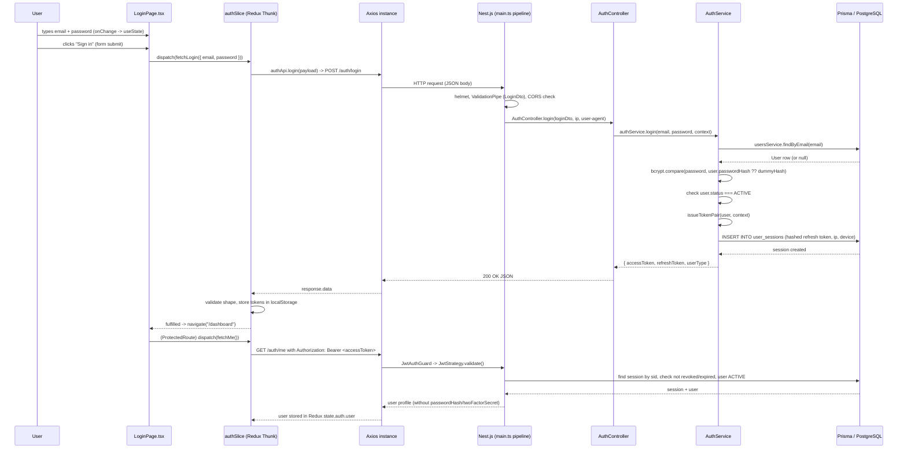

# Login Flow — Step-by-Step Analysis

This document traces exactly what happens, end to end, when a user types an
email, types a password, and submits the sign-in form on the **platform-admin**
frontend, all the way through the **backend** (NestJS + Prisma + PostgreSQL).

It reflects the current state of the code:

- Frontend: `platform-admin/src/pages/auth/LoginPage.tsx`, `store/auth/authSlice.ts`,
  `api/auth.ts`, `lib/axios.ts`, `lib/storage.ts`
- Backend: `backend/src/auth/auth.controller.ts`, `auth.service.ts`,
  `dto/login-dto.ts`, `jwt.strategy.ts`, `guards/jwt-auth.guard.ts`,
  `backend/src/main.ts`, `backend/prisma/schema.prisma`

---

## 1. Architecture in one picture



---

## 2. Typing the email — what happens on the frontend

File: `platform-admin/src/pages/auth/LoginPage.tsx`

- The email `<Input>` is a **controlled component**: its `value` is the React
  state variable `email` (`useState<string>("")`), and every keystroke fires
  `onChange={(e) => setEmail(e.target.value)}`.
- Nothing is sent to the backend while typing. There is no live "is this email
  already registered" check, no debounce, no async validation call.
- The input has `type="email"`, `autoComplete="username"`, and `required`.
  These are native HTML attributes: the browser will refuse to submit the form
  (and show its own tooltip) if the field is empty or does not look like an
  email address, **before** `handleSubmit` is even called. This is a client-side
  UX guard only, not a security control — the backend still validates
  independently (section 5).
- While `isSubmitting` is `true`, the field is `disabled` so the user cannot
  edit it mid-request.

## 3. Typing the password — what happens on the frontend

Same pattern as the email field:

- Controlled input bound to `password` state, updated via `onChange`.
- `type="password"` masks the characters visually; `autoComplete="current-password"`
  hints the browser's password manager.
- `required` triggers native validation on submit if the field is empty.
- No client-side password strength/format rule is enforced on the login form
  (unlike a signup form) — the backend DTO only requires it to be a non-empty
  string (section 5). The actual correctness of the password is only known
  after the backend compares it against the stored hash.

## 4. Submitting the form

`handleSubmit` (in `LoginPage.tsx`):

1. `e.preventDefault()` stops the browser's native form navigation/reload.
2. `setIsSubmitting(true)` and `setError(null)` reset UI state and disable
   inputs/button, swapping the button label for a spinner ("Signing in...").
3. `await dispatch(fetchLogin({ email, password })).unwrap()` dispatches a
   Redux Toolkit **async thunk** (`platform-admin/src/store/auth/authSlice.ts`).
   `.unwrap()` makes the promise reject with the thunk's rejected payload
   instead of resolving with an action object, so it can be caught with a
   plain `try/catch`.
4. On success: `navigate("/dashboard")`.
5. On failure: the thrown value (a string message) is placed into `error`
   state and rendered under the fields.
6. `finally` always resets `isSubmitting` back to `false`.

### 4.1 The thunk (`fetchLogin`)

```
authApi.login(payload) -> POST /auth/login
```

- `authApi.login` (`platform-admin/src/api/auth.ts`) calls the shared `Axios`
  instance (`platform-admin/src/lib/axios.ts`) with `POST /auth/login` and the
  `{ email, password }` body, returning `response.data`.
- **Request interceptor**: before the request leaves the browser, Axios checks
  `isPublicAuthPath(config.url)`. `/auth/login` and `/auth/refresh` are in the
  public list, so **no `Authorization` header is attached** for this call (there
  is no token yet anyway).
- The request goes to `VITE_APP_API_BASE_URL` (falls back to
  `http://localhost:4000`) — a plain cross-origin HTTP call from the
  platform-admin dev server to the Nest API.

## 5. Backend request pipeline (before the controller runs)

File: `backend/src/main.ts`

1. **helmet()** — sets hardened security headers on every response (CSP,
   `X-Frame-Options`, etc.).
2. **Global `ValidationPipe`** with:
   - `whitelist: true` — strips any body property not declared on the DTO.
   - `forbidNonWhitelisted: true` — if an extra property is present, the
     request is rejected with `400 Bad Request` instead of silently dropping it.
   - `transform: true` — the raw JSON body is turned into a real `LoginDto`
     instance and `class-validator` decorators run against it:
     - `email` must satisfy `@IsEmail()`.
     - `password` must satisfy `@IsString()` + `@IsNotEmpty()`.
   - If validation fails, the pipe throws before `AuthController.login` is ever
     invoked, and the response is `400` with a `message` array (e.g.
     `["email must be an email"]`).
3. **CORS**: only enabled if `CORS_ORIGINS` is set in the environment; the
   platform-admin dev origin must be in that comma-separated whitelist, and
   `credentials: true` allows the `Authorization` header / cookies to flow
   cross-origin.
4. **`AllExceptionsFilter`** (`backend/src/common/filters/all-exceptions.filter.ts`)
   is the catch-all: any exception thrown anywhere in the request (including
   from `AuthService`) is normalized into
   `{ statusCode, message, error, path, timestamp }`. For a non-`HttpException`
   (a genuine bug/crash), it deliberately replaces the real message with
   `"Internal server error"` so stack traces/SQL fragments never leak to the
   client; it also logs the real exception server-side.

## 6. `AuthController.login`

File: `backend/src/auth/auth.controller.ts`

```ts
@Post('login')
@HttpCode(HttpStatus.OK)
login(@Body() loginDto: LoginDto, @Ip() ip: string, @Headers('user-agent') userAgent?: string)
```

- Route is public (no `@UseGuards(JwtAuthGuard)`).
- Forces `200 OK` on success instead of Nest's default `201 Created` for `POST`.
- Captures the caller's IP (`@Ip()`) and `User-Agent` header — passed down as
  "login context" purely for the session record (device/IP metadata), not for
  any authentication decision.
- Delegates everything to `AuthService.login(email, password, context)`.

## 7. `AuthService.login` — the actual authentication logic

File: `backend/src/auth/auth.service.ts`

```ts
const user = await this.usersService.findByEmail(email);
const passwordMatches = await bcrypt.compare(
  password,
  user?.passwordHash ?? ABSENT_USER_PASSWORD_HASH,
);
if (!user || !passwordMatches) {
  throw new BadRequestException('Invalid email or password');
}
if (user.status !== UserStatus.ACTIVE) {
  throw new ForbiddenException('This account is not active');
}
```

Step by step:

1. **`findByEmail`** (`backend/src/users/users.service.ts`) runs
   `prisma.user.findUnique({ where: { email } })`. The `email` column is
   Postgres `Citext` (case-insensitive text), so `Foo@Example.com` matches a
   stored `foo@example.com` — one SQL `SELECT` against the `users` table.
2. **Password check**: `bcrypt.compare` always runs, even if `user` is `null`.
   In that case it compares against a hardcoded dummy bcrypt hash
   (`ABSENT_USER_PASSWORD_HASH`). This is a deliberate **timing-attack /
   user-enumeration mitigation**: without it, a request for a non-existent
   email would return instantly (no hash to compare), while a request for a
   real email would take the ~100ms bcrypt takes — letting an attacker infer
   which emails exist just from response time. Comparing against a dummy hash
   keeps the timing the same in both cases.
3. Whichever failed — user not found, or password wrong — the response is the
   **same generic message**, `"Invalid email or password"`, with `400 Bad
   Request`. The frontend/attacker cannot tell which one was wrong.
4. If the credentials matched but the account's `status` isn't `ACTIVE`
   (e.g. `SUSPENDED`), a `403 Forbidden` ("This account is not active") is
   thrown instead — this is the first point where a *different* error message
   is possible, but only after the password has already been proven correct.
5. On success, `issueTokenPair(user, context)` is called.

## 8. Issuing tokens and creating a session

```ts
async issueTokenPair(user, context) {
  const sessionId = createId();               // cuid2
  const tokens = await this.signTokenPair(user, sessionId);
  await this.prisma.userSession.create({
    data: {
      id: sessionId,
      userId: user.id,
      deviceLabel: context.deviceLabel,        // User-Agent
      ipAddress: context.ipAddress,
      refreshTokenHash: this.hashRefreshToken(tokens.refreshToken),
      expiresAt: this.refreshTokenExpiresAt(tokens.refreshToken),
    },
  });
  return tokens;
}
```

- A new opaque **session id** (`cuid2`) is generated for this login — it is
  *not* the JWT itself, it identifies a row in the `user_sessions` table so a
  session can be revoked (logout) independently of the JWT's own expiry.
- **`signTokenPair`** signs two JWTs in parallel with `JwtService`:
  - **Access token** payload: `{ userId, email, userType, sid: sessionId }`,
    signed with `JWT_ACCESS_SECRET`, expiring after `JWT_ACCESS_EXPIRES_IN`.
  - **Refresh token** payload: `{ userId, sessionId }`, signed with a
    *different* secret `JWT_REFRESH_SECRET`, expiring after
    `JWT_REFRESH_EXPIRES_IN` (normally much longer-lived).
  - Using two separate secrets means a leaked access token cannot be used to
    forge a refresh token and vice versa.
- **The refresh token is never stored raw.** `hashRefreshToken` computes
  `HMAC-SHA256(JWT_REFRESH_SECRET, "refresh-token:" + refreshToken)` and only
  that digest is written to `user_sessions.refresh_token_hash`. Even a full
  database leak does not hand out usable refresh tokens.
- `expiresAt` is derived by decoding the refresh JWT's own `exp` claim, so the
  DB record's expiry always matches the token's real expiry.
- One row is inserted into `user_sessions` (`ip_address`, `device_label` come
  straight from the request's IP/User-Agent captured in the controller).
- The method returns `{ accessToken, refreshToken }`; `login()` adds
  `userType` and returns `{ accessToken, refreshToken, userType }` as the
  final HTTP response body.

## 9. Response reaches the frontend

Back in `platform-admin/src/store/auth/authSlice.ts`, `fetchLogin`:

```ts
const tokens = await authApi.login(payload);
if (!isCompleteLoginResponse(tokens)) {
  return rejectWithValue("Could not Sign in: incomplete response");
}
storage.setItem(ACCESS_TOKEN, tokens.accessToken);
storage.setItem(REFRESH_TOKEN, tokens.refreshToken);
storage.setItem(USER_TYPE, tokens.userType);
return tokens;
```

- `isCompleteLoginResponse` is a runtime type guard: it re-checks that
  `accessToken`/`refreshToken` are non-empty strings and `userType` is a known
  enum value, in case the backend ever returns a partial/malformed body.
- Both tokens and the `userType` are written to `localStorage` under
  versioned keys (`auth:v1:access-token`, etc.) via `platform-admin/src/lib/storage.ts`,
  which wraps every read/write in `try/catch` (private-browsing / storage
  quota issues degrade gracefully instead of throwing).
- On `fetchLogin.fulfilled`, the Redux slice sets `accessToken`, `refreshToken`,
  `userType` and `status: "succeeded"`.
- Back in `LoginPage`, the `await ... .unwrap()` call resolves, and
  `navigate("/dashboard")` fires.
- If anything above throws (network error, 400, 403, malformed response), the
  `catch` branch calls `storage.clearSession()` (wipes any stale tokens) and
  rejects with a human-readable message extracted by
  `getAxiosErrorMessage` — which reads `error.response.data.message` (a string
  or the first entry of the validation-error array) and falls back to a
  generic default. That string is what `LoginPage` shows under the form.

## 10. Immediately after redirect: `/dashboard` and `/auth/me`

`platform-admin/src/components/ProtectedRoute.tsx` guards `/dashboard`:

- It reads `accessToken`, `status`, `user` from Redux.
- If a token exists, it dispatches `fetchMe()` on mount.
- `fetchMe` calls `GET /auth/me`. This time the request is **not** on the
  public-path list, so the Axios request interceptor attaches
  `Authorization: Bearer <accessToken>`.
- Until `user` is populated, `ProtectedRoute` renders a `Loading...` placeholder;
  if there is no token, or the thunk fails, it redirects to `/auth/login`.

### Backend side of `/auth/me`

- `@UseGuards(JwtAuthGuard)` runs Passport's `jwt` strategy
  (`backend/src/auth/jwt.strategy.ts`) **before** the controller method:
  1. Extracts the bearer token from the `Authorization` header.
  2. Verifies its signature and expiry against `JWT_ACCESS_SECRET`.
  3. `validate(payload)` loads the session row by `payload.sid`, rejecting
     with `401` if the session doesn't exist, is `revokedAt`-set, or has
     passed `expiresAt` (this makes logout / forced session revocation work
     even though the JWT itself hasn't expired yet).
  4. Rejects with `401` if the user's `status` is no longer `ACTIVE`.
  5. Returns `{ userId, email, userType, sessionId }`, which Nest/Passport
     attaches to `request.user`.
- `AuthController.me` reads that via the `@CurrentUser()` param decorator and
  calls `authService.me(userId)`, which does
  `prisma.user.findUnique({ where: { id }, omit: { passwordHash: true, twoFactorSecret: true } })`
  — the password hash and 2FA secret are never serialized into any API response.
- The frontend stores the returned profile in `state.auth.user`, additionally
  computing `avatarName` (initials) client-side from `fullName`/`email`.

## 11. What happens on a wrong email or wrong password

| Situation | Where it's caught | HTTP status | Message shown to user |
|---|---|---|---|
| Email fails `@IsEmail()` format (e.g. missing `@`) | `ValidationPipe`, before the controller | 400 | first validator message, e.g. "email must be an email" |
| Password empty | `ValidationPipe` | 400 | "password should not be empty" |
| Extra/unexpected body field | `ValidationPipe` (`forbidNonWhitelisted`) | 400 | validation error |
| Email not registered | `AuthService.login` | 400 | "Invalid email or password" (generic, on purpose) |
| Email registered, wrong password | `AuthService.login` | 400 | "Invalid email or password" (same generic message) |
| Correct credentials, account not `ACTIVE` | `AuthService.login` | 403 | "This account is not active" |
| Network/CORS/unreachable backend | Axios (no `response`) | — | falls back to the thunk's default message, e.g. "Could not Sign in" |
| Unhandled server exception | `AllExceptionsFilter` | 500 | "Internal server error" (real error only in server logs) |

In every 400/403/500 case, `getAxiosErrorMessage` reads the JSON error body
Nest's `AllExceptionsFilter` produces and surfaces it as a plain string under
the login form; nothing crashes the UI.

## 12. Related mechanism: silent token refresh

Not part of the login form itself, but directly downstream of the tokens it
produces (`platform-admin/src/lib/axios.ts`):

- Every *authenticated* request that comes back `401` (and isn't already a
  retry, and did carry an `Authorization` header) triggers a single shared
  `POST /auth/refresh` call with the stored refresh token
  (`AuthService.refresh` re-validates the JWT signature, loads the session,
  checks it's not revoked/expired, verifies the refresh token's HMAC against
  the stored hash with `timingSafeEqual` — a constant-time comparison to avoid
  leaking how many hash bytes matched — then rotates both tokens and updates
  the same session row).
- Concurrent 401s share one in-flight refresh call (`pendingRefresh`) instead
  of firing multiple refresh requests.
- If the refresh itself fails, the session is cleared from `localStorage` and
  the browser is hard-redirected to `/auth/login`.

## 13. Security properties worth calling out

- **No user enumeration via timing**: unknown email still pays the full
  bcrypt cost against a dummy hash.
- **No user enumeration via message**: bad email and bad password return the
  identical error string and status code.
- **Refresh tokens are hashed at rest** (HMAC-SHA256), never stored as
  plaintext JWTs in the database.
- **Constant-time comparison** (`timingSafeEqual`) when checking a presented
  refresh token against its stored hash.
- **Separate signing secrets** for access vs. refresh tokens.
- **Sessions are revocable server-side** (`revokedAt`) independent of JWT
  expiry, and every authenticated request re-checks the session row, not just
  the JWT signature.
- **Password hash and 2FA secret are never returned** by `/auth/me` (`omit`
  in the Prisma query).
- **Strict input validation** (`whitelist` + `forbidNonWhitelisted`) rejects
  any unexpected body field before it reaches business logic.
- **Generic 500 messages**: any unexpected/internal exception is never
  forwarded verbatim to the client, only logged server-side.
