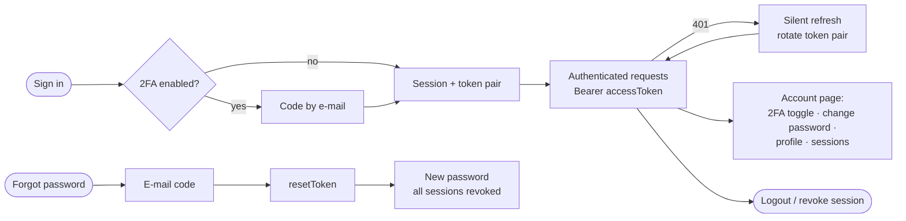
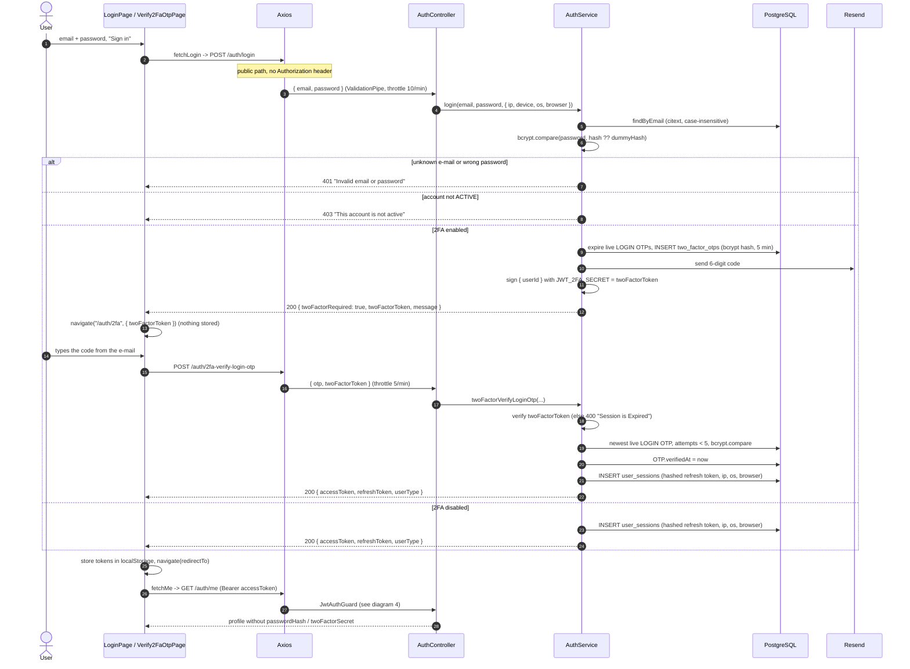
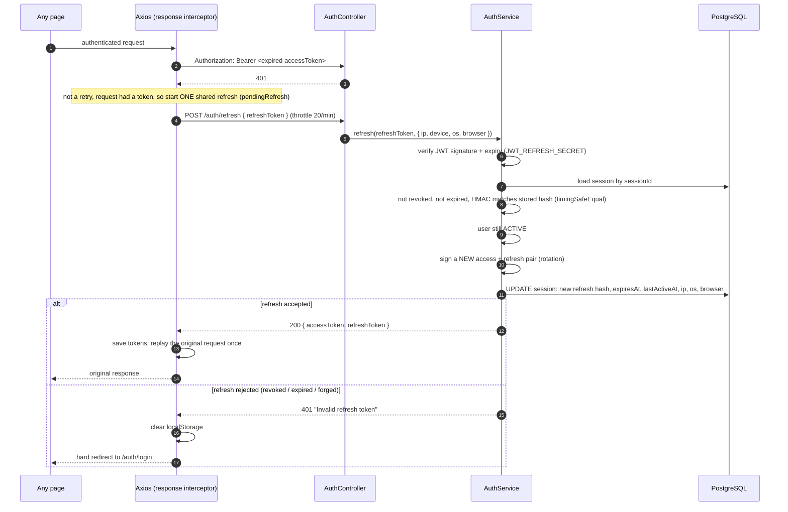
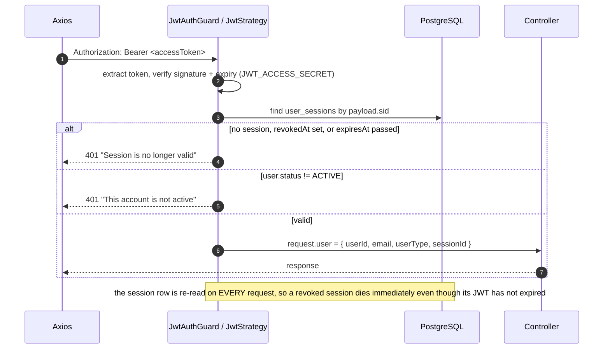
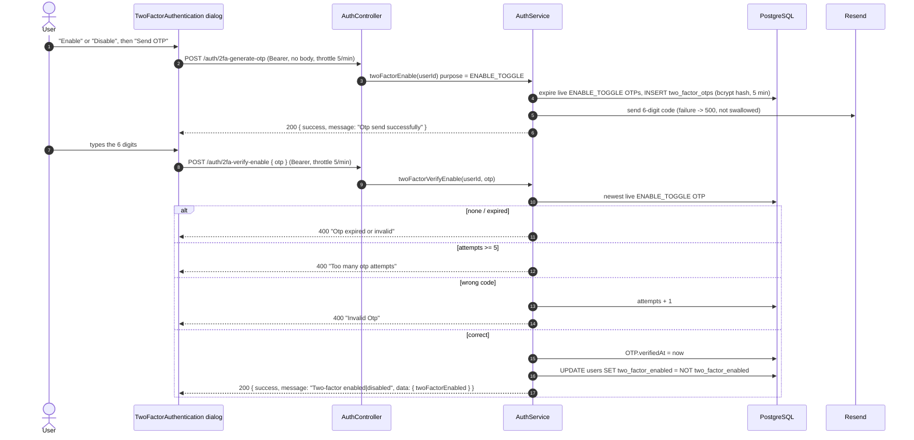
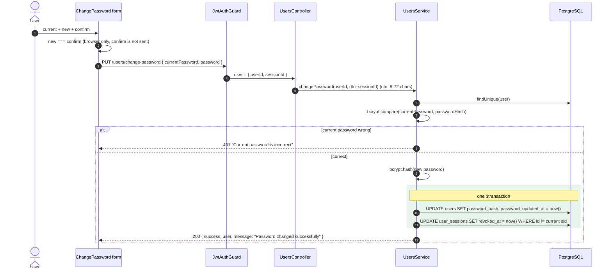
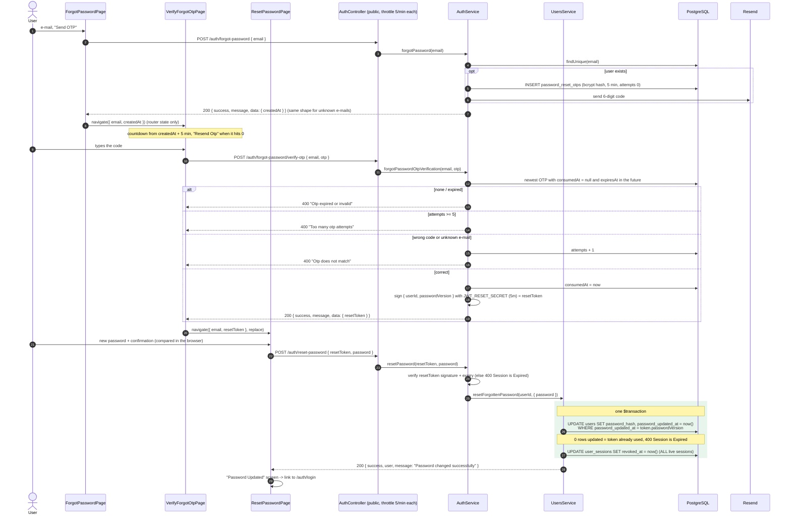
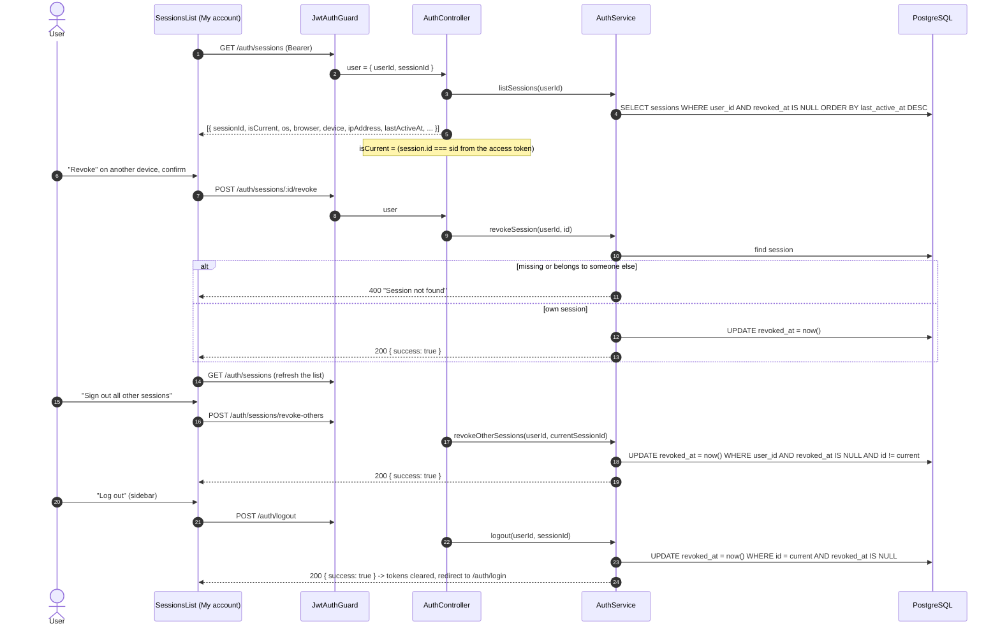
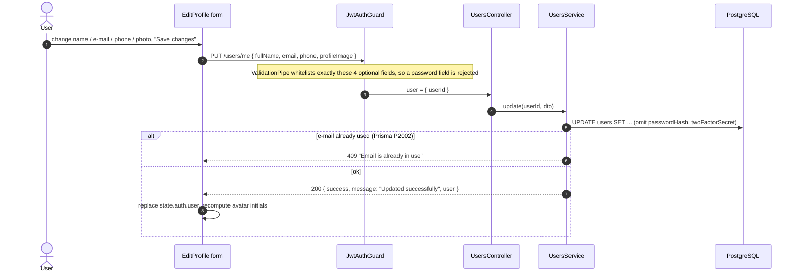

# Auth & Account Security — Sequence Diagrams

A compact, diagram-only companion to [`AUTH_FLOW.md`](AUTH_FLOW.md) (the detailed
step-by-step analysis) and [`AUTH_FLOW_RU.pdf`](AUTH_FLOW_RU.pdf) (the Russian
walkthrough with real Network screenshots). Every diagram reflects the current code of
**platform-admin** (React + Redux Toolkit + Axios) and **backend** (NestJS + Prisma +
PostgreSQL + Resend).

Participants used throughout:

| Name in diagrams | What it is |
|---|---|
| Browser / UI | the platform-admin pages and the `authSlice` thunks |
| Axios | `platform-admin/src/lib/axios.ts` (request + 401 interceptors) |
| Guard | `JwtAuthGuard` → `JwtStrategy.validate()` |
| AuthController / AuthService | `backend/src/auth/*` |
| UsersService | `backend/src/users/users.service.ts` |
| DB | PostgreSQL via Prisma (`users`, `user_sessions`, `two_factor_otps`, `password_reset_otps`) |
| Resend | e-mail provider used by `EmailService` |

Quick map of the tokens that appear below:

| Token | Signed with | Lifetime | Purpose |
|---|---|---|---|
| `accessToken` | `JWT_ACCESS_SECRET` | `JWT_ACCESS_EXPIRES_IN` (15m) | authenticates API calls; carries `sid` (session id) |
| `refreshToken` | `JWT_REFRESH_SECRET` | `JWT_REFRESH_EXPIRES_IN` (30d) | rotates the pair; only its HMAC is stored in `user_sessions` |
| `twoFactorToken` | `JWT_2FA_SECRET` | `JWT_2FA_EXPIRES_IN` (15m) | "ticket" between password step and code step of a 2FA login |
| `resetToken` | `JWT_RESET_SECRET` | `JWT_RESET_EXPIRES_IN` (5m) | proves the e-mailed reset code was verified |

---

## 1. Overview — the whole lifecycle

---

## 2. Sign in (with and without 2FA)

---

## 3. Silent token refresh

---

## 4. Every protected request (what the guard checks)

---

## 5. Two-factor authentication — enable / disable (one toggle)

---

## 6. Change password (signed in)

---

## 7. Forgot password — e-mail code → reset token → new password

> Hardening (details in `AUTH_FLOW.md`, section 14a): the `resetToken` is single-use because
> it is bound to the password version (`password_updated_at`) it was issued against; an
> invalid or expired token is a `400`; `POST /auth/reset-password` enforces the same 8–72
> character rule as `change-password`. Remaining gap: resetting does not require 2FA.

---

## 8. Active sessions, revoke, logout

---

## 9. Edit profile

---

## Endpoint index

| Endpoint | Auth | Throttle / min | Diagram |
|---|---|---|---|
| `POST /auth/login` | public | 10 | 2 |
| `POST /auth/2fa-verify-login-otp` | public (`twoFactorToken`) | 5 | 2 |
| `POST /auth/refresh` | public (`refreshToken`) | 20 | 3 |
| `GET /auth/me` | Bearer | — | 2, 4 |
| `POST /auth/2fa-generate-otp` | Bearer | 5 | 5 |
| `POST /auth/2fa-verify-enable` | Bearer | 5 | 5 |
| `PUT /users/change-password` | Bearer | — | 6 |
| `POST /auth/forgot-password` | public | 5 | 7 |
| `POST /auth/forgot-password/verify-otp` | public | 5 | 7 |
| `POST /auth/reset-password` | public (`resetToken`) | 5 | 7 |
| `GET /auth/sessions` | Bearer | — | 8 |
| `POST /auth/sessions/:id/revoke` | Bearer | — | 8 |
| `POST /auth/sessions/revoke-others` | Bearer | — | 8 |
| `POST /auth/logout` | Bearer | — | 8 |
| `PUT /users/me` | Bearer | — | 9 |
