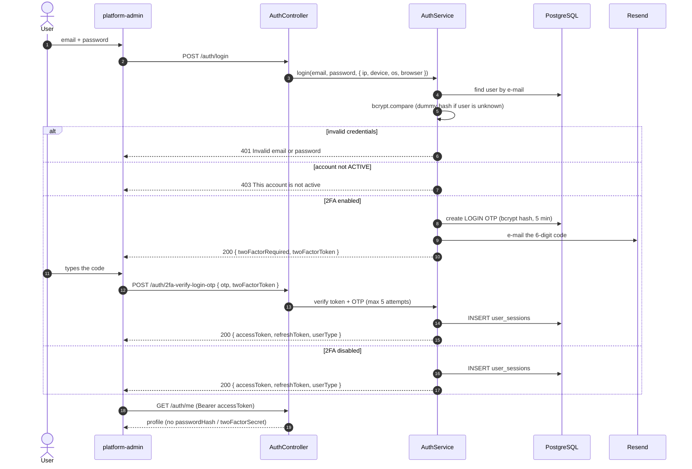
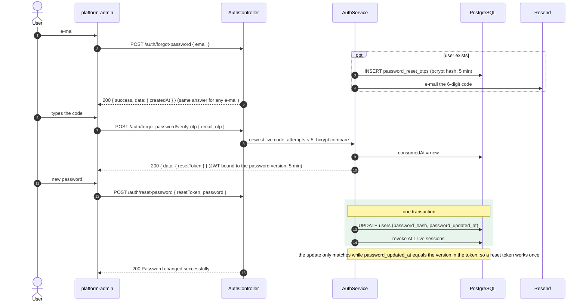
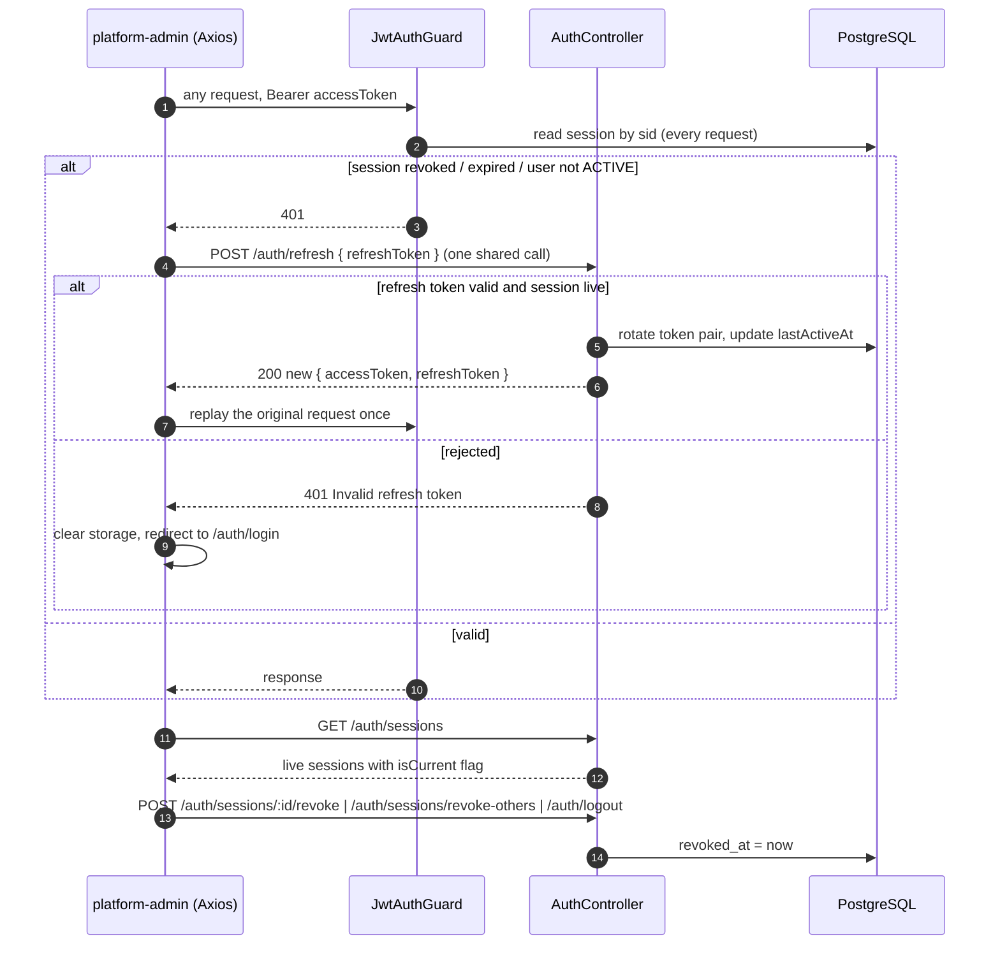
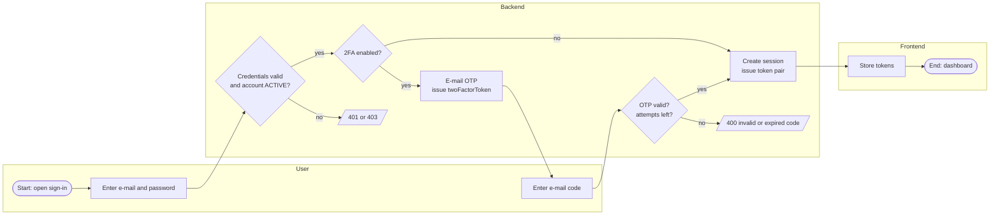
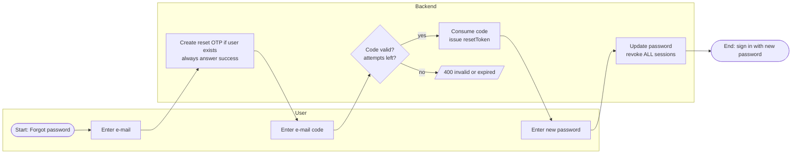

# Multi-tenant E-commerce Platform — Platform Admin & Auth Service

A multi-tenant marketplace platform. This repository currently contains:

- **`backend/`** — NestJS + Prisma + PostgreSQL API. Fully implemented: authentication
  (JWT access/refresh tokens, revocable sessions), e-mail two-factor authentication (2FA),
  password reset, password change and profile management.
- **`platform-admin/`** — React + Redux Toolkit + Vite admin console for platform administrators.
  The sign-in, 2FA, forgot/reset password and **My account** screens (profile, password,
  2FA, active sessions) are implemented; the other dashboard sections (Sellers, Orders,
  Customers, …) are scaffolded placeholders.

> Everything below focuses on the implemented area: **authentication and account security**.
> The deep-dive documents are linked in [Links to documentation](#links-to-documentation).

## Table of Contents

- [Sequence Diagram](#sequence-diagram)
  - [Sequence Diagram Sign In (with 2FA)](#sequence-diagram-sign-in-with-2fa)
  - [Sequence Diagram Forgot Password](#sequence-diagram-forgot-password)
  - [Sequence Diagram Sessions and Token Refresh](#sequence-diagram-sessions-and-token-refresh)
- [Endpoints](#endpoints)
  - [Endpoints Authentication](#endpoints-authentication)
  - [Endpoints Sessions](#endpoints-sessions)
  - [Endpoints Password Reset](#endpoints-password-reset)
  - [Endpoints Account (Users)](#endpoints-account-users)
- [Service Logic](#service-logic)
  - [Service Logic Sign In and 2FA](#service-logic-sign-in-and-2fa)
  - [Service Logic Password Reset and Change](#service-logic-password-reset-and-change)
  - [Service Logic Sessions](#service-logic-sessions)
- [BPMN Diagram](#bpmn-diagram)
  - [BPMN Diagram Sign In](#bpmn-diagram-sign-in)
  - [BPMN Diagram Forgot Password](#bpmn-diagram-forgot-password)
- [Requirements](#requirements)
- [How to run :rocket:](#how-to-run-rocket)
- [Env variables](#env-variables)
- [Testing](#testing)
- [Troubleshooting](#troubleshooting)
- [Documentation for key libraries](#documentation-for-key-libraries)
- [Code structure](#code-structure)
- [Team](#team)
- [Links to documentation](#links-to-documentation)
  - [Links to documentation Authentication](#links-to-documentation-authentication)
  - [Links to documentation Account Security](#links-to-documentation-account-security)
  - [Technical Docs](#technical-docs)
  - [Integrations](#integrations)

---

## Sequence Diagram

Compact versions of the three most important flows. All nine diagrams (2FA toggle,
change password, profile, guard checks, …) live in [`AUTH_SEQUENCE.md`](AUTH_SEQUENCE.md).

### Sequence Diagram Sign In (with 2FA)



### Sequence Diagram Forgot Password



### Sequence Diagram Sessions and Token Refresh



## Endpoints

Base URL: `http://localhost:4000`. All bodies are JSON; unknown body fields are rejected
(`whitelist` + `forbidNonWhitelisted`). Errors come back as
`{ statusCode, message, error, path, timestamp }`. A global throttle of 60 requests per
minute applies to every route; stricter per-route limits are listed below.

### Endpoints Authentication

| Method & path | Auth | Body | Success | Limit / min |
|---|---|---|---|---|
| `POST /auth/login` | public | `{ email, password }` | `{ accessToken, refreshToken, userType }` or `{ twoFactorRequired, twoFactorToken, message }` | 10 |
| `POST /auth/2fa-verify-login-otp` | public (`twoFactorToken`) | `{ otp, twoFactorToken }` | `{ accessToken, refreshToken, userType }` | 5 |
| `POST /auth/refresh` | public (`refreshToken`) | `{ refreshToken }` | `{ accessToken, refreshToken }` | 20 |
| `POST /auth/logout` | Bearer | — | `{ success }` | — |
| `GET /auth/me` | Bearer | — | user profile | — |
| `POST /auth/2fa-generate-otp` | Bearer | — | `{ success, message }` | 5 |
| `POST /auth/2fa-verify-enable` | Bearer | `{ otp }` | `{ success, message, data: { twoFactorEnabled } }` (toggles) | 5 |

### Endpoints Sessions

| Method & path | Auth | Body | Success |
|---|---|---|---|
| `GET /auth/sessions` | Bearer | — | `[{ sessionId, isCurrent, os, browser, device, ipAddress, createdAt, lastActiveAt, expiresAt }]` |
| `POST /auth/sessions/:id/revoke` | Bearer | — | `{ success }` (`400 Session not found` for foreign ids) |
| `POST /auth/sessions/revoke-others` | Bearer | — | `{ success }` |

### Endpoints Password Reset

| Method & path | Auth | Body | Success | Limit / min |
|---|---|---|---|---|
| `POST /auth/forgot-password` | public | `{ email }` | `{ success, message, data: { createdAt } }` | 5 |
| `POST /auth/forgot-password/verify-otp` | public | `{ email, otp }` | `{ success, message, data: { resetToken } }` | 5 |
| `POST /auth/reset-password` | public (`resetToken`) | `{ resetToken, password }` | `{ success, user, message }` | 5 |

### Endpoints Account (Users)

| Method & path | Auth | Body | Success |
|---|---|---|---|
| `PUT /users/me` | Bearer | `{ fullName?, email?, phone?, profileImage? }` | `{ success, message, user }` (`409` if e-mail is taken) |
| `PUT /users/change-password` | Bearer | `{ currentPassword, password }` (8–72 chars) | `{ success, message, user }` |

Full request/response examples captured from a real run: [`AUTH_FLOW.md`](AUTH_FLOW.md)
and the Russian walkthrough [`AUTH_FLOW_RU.pdf`](AUTH_FLOW_RU.pdf).

## Service Logic

### Service Logic Sign In and 2FA

- Passwords are checked with `bcrypt`. For an unknown e-mail a dummy hash is compared so
  response time does not reveal which e-mails exist; both failures return the same
  `401 Invalid email or password`.
- With 2FA on, `login` issues **no tokens**. It e-mails a 6-digit OTP (stored as a bcrypt
  hash, valid 5 minutes, max 5 wrong attempts) and returns a `twoFactorToken` signed with
  `JWT_2FA_SECRET`. The session is created only after `2fa-verify-login-otp` succeeds.
- OTPs carry a **purpose** (`LOGIN`, `ENABLE_TOGGLE`), so a code for one action cannot be
  used for the other. Requesting a new code expires the previous live one.
- Enabling and disabling 2FA is one toggle: `2fa-verify-enable` always flips
  `users.two_factor_enabled`.
- Access token: `{ userId, email, userType, sid }` (`JWT_ACCESS_SECRET`). Refresh token:
  `{ userId, sessionId }` (`JWT_REFRESH_SECRET`); only its HMAC-SHA256 is stored in
  `user_sessions.refresh_token_hash` and compared in constant time.

### Service Logic Password Reset and Change

- **Forgot password**: the answer is identical for known and unknown e-mails. Codes live in
  `password_reset_otps` (5 min, 5 attempts, `consumedAt` on success). A verified code is
  exchanged for a 5-minute `resetToken` signed with `JWT_RESET_SECRET`.
- **Reset** and **change** both write the new hash and `password_updated_at` and revoke
  sessions in a single Prisma transaction. Reset revokes **all** live sessions; change
  keeps only the current one and requires `currentPassword`.
- The `resetToken` carries the user's `password_updated_at` at issue time; the reset only
  updates a row that still has that value, so the token is **single-use** (a replay is a
  `400 Session is Expired`). An invalid or expired token is also a `400`, and
  `POST /auth/reset-password` enforces the 8–72 character rule like `change-password`.
- Remaining gap (a policy decision, details in `AUTH_FLOW.md`, section 14a): resetting a
  password does not require 2FA — whoever controls the mailbox bypasses the second factor.

### Service Logic Sessions

- Each sign-in creates a `user_sessions` row (`os`, `browser`, `device`, `ipAddress`,
  hashed refresh token, `expiresAt`).
- `JwtStrategy.validate` re-reads the session on **every** request and rejects revoked or
  expired sessions and non-`ACTIVE` users, so revocation is immediate.
- `refresh` rotates both tokens for the same session and updates `lastActiveAt`, IP and
  device info (this is what "last active" means).
- Sessions are revoked by logout (current), `revoke` (one), `revoke-others`, password
  change (others) and password reset (all).

## BPMN Diagram

BPMN-style process maps (lanes shown as subgraphs), rendered with Mermaid. The repository
holds no `.bpmn` files.

### BPMN Diagram Sign In



### BPMN Diagram Forgot Password



## Requirements

- **Node.js** and **npm** (developed with Node.js v25.8; each package has its own
  `package-lock.json`).
- **PostgreSQL** with the `citext` extension (created automatically by the first Prisma
  migration; the database user needs permission to create extensions). Any provider works,
  for example a local server or [Neon](https://neon.tech).
- A **[Resend](https://resend.com)** account and API key for the OTP e-mails.
- Free ports **4000** (API) and **3002** (admin console).

## How to run :rocket:

```bash
# 1. Backend
cd backend
npm install                      # also runs `prisma generate`
cp .env.example .env             # then fill in the values, see "Env variables"
npm run prisma:migrate           # create/update the database schema (dev)
npm run db:seed                  # optional: creates a PLATFORM_ADMIN user, see prisma/seed.ts
npm run start:dev                # API on http://localhost:4000 (watch mode)

# 2. Admin console (second terminal)
cd platform-admin
npm install
echo "VITE_APP_API_BASE_URL=http://localhost:4000" > .env
npm run dev -- --port 3002       # http://localhost:3002
```

Open `http://localhost:3002/auth/login`. `CORS_ORIGINS` in the backend must contain the
console's origin (`http://localhost:3002`).

Other useful scripts:

| Where | Command | What it does |
|---|---|---|
| backend | `npm run build` / `npm run start:prod` | compile and run `dist/main` |
| backend | `npm run prisma:deploy` | apply migrations in production |
| backend | `npm run prisma:studio` | browse the database |
| backend | `npm run lint` / `npm run format` | oxlint / prettier |
| platform-admin | `npm run build` / `npm run preview` | type-check, bundle, preview |
| platform-admin | `npm run lint` | eslint |

> The seed script contains a hard-coded development e-mail and password. Change them (or
> do not run it) for any shared or production database.

## Env variables

### Backend (`backend/.env`, validated at start-up by `src/config/env.validation.ts`)

| Variable | Required | Default | Description |
|---|---|---|---|
| `DATABASE_URL` | yes | — | PostgreSQL connection string (Prisma CLI and runtime adapter) |
| `NODE_ENV` | no | `development` | runtime mode |
| `PORT` | no | `4000` | HTTP port |
| `CORS_ORIGINS` | no | unset (CORS off) | comma-separated allowed origins |
| `JWT_ACCESS_SECRET` | yes | — | ≥ 32 chars, signs access tokens |
| `JWT_REFRESH_SECRET` | yes | — | ≥ 32 chars, signs refresh tokens and keys the stored HMAC |
| `JWT_2FA_SECRET` | yes | — | ≥ 32 chars, signs the 2FA challenge token |
| `JWT_RESET_SECRET` | yes | — | ≥ 32 chars, signs the password-reset token |
| `JWT_ACCESS_EXPIRES_IN` | no | `15m` | any `ms` span |
| `JWT_REFRESH_EXPIRES_IN` | no | `30d` | any `ms` span |
| `JWT_2FA_EXPIRES_IN` | no | `15m` | any `ms` span |
| `JWT_RESET_EXPIRES_IN` | no | `5m` | any `ms` span |
| `RESEND_API_KEY` | yes | — | Resend API key |
| `RESEND_FROM_EMAIL` | yes | — | sender address for OTP e-mails |

Use a different random value for each secret.

### Admin console (`platform-admin/.env`)

| Variable | Required | Default | Description |
|---|---|---|---|
| `VITE_APP_API_BASE_URL` | no | `http://localhost:4000` | backend base URL used by Axios |

## Testing

```bash
# backend (Vitest)
cd backend
npm test                # unit tests
npm run test:watch
npm run test:cov        # coverage
npm run test:e2e        # test/app.e2e-spec.ts, uses vitest.config.e2e.ts

# admin console (Vitest + Testing Library)
cd platform-admin
npm test
npm run test:watch
```

Backend specs cover `AuthService`, `AuthController`, `UsersService`, `UsersController`,
`EmailService` and `PrismaService`; the console has component tests (route guard, sidebar,
inputs, error boundary, …) and `authSlice` tests.

## Troubleshooting

| Symptom | Likely cause and fix |
|---|---|
| Backend exits at start-up with a validation error | a required variable is missing or a JWT secret is shorter than 32 characters — compare `.env` with `.env.example` |
| Browser shows a CORS error | `CORS_ORIGINS` is unset (CORS stays disabled) or does not contain the exact console origin, e.g. `http://localhost:3002` |
| `Cannot find module …/generated/prisma` | run `npm run prisma:generate` (normally done by `postinstall`) |
| Prisma cannot connect / SSL error | check `DATABASE_URL` and its `sslmode`; the DB user must be able to create the `citext` extension |
| `429 Too Many Requests` | per-route throttling (see [Endpoints](#endpoints)); wait a minute |
| OTP e-mail never arrives, or the API answers `500 Failed to send OTP email` | invalid `RESEND_API_KEY`, or the sender is not allowed to reach that recipient — Resend's shared test sender only delivers to the account owner; verify a domain and set `RESEND_FROM_EMAIL` |
| `400 Session is Expired` on the 2FA page | the `twoFactorToken` lives in memory only; a page reload or waiting past `JWT_2FA_EXPIRES_IN` requires signing in again |
| `Otp expired or invalid` / `Too many otp attempts` | codes live 5 minutes and allow 5 wrong tries; request a new one |
| Signed out unexpectedly | the session was revoked (logout elsewhere, password change or reset) or the refresh token expired |
| Reset password answers `400 Session is Expired` | the `resetToken` expired (5 minutes) or was already used — restart the flow from "Forgot password" |
| Stuck on `Loading...` after sign-in | `/auth/me` failed with a non-401 error; check that the API is running and `VITE_APP_API_BASE_URL` is correct |

## Documentation for key libraries

- Backend: [NestJS](https://docs.nestjs.com), [Prisma](https://www.prisma.io/docs),
  [Passport JWT](https://www.passportjs.org/packages/passport-jwt/),
  [`@nestjs/throttler`](https://docs.nestjs.com/security/rate-limiting),
  [Resend](https://resend.com/docs), [`ua-parser-js`](https://docs.uaparser.dev),
  [bcryptjs](https://github.com/dcodeIO/bcrypt.js), [Vitest](https://vitest.dev)
- Admin console: [React](https://react.dev), [Vite](https://vite.dev),
  [Redux Toolkit](https://redux-toolkit.js.org), [React Router](https://reactrouter.com),
  [Axios](https://axios-http.com), [shadcn/ui](https://ui.shadcn.com),
  [Tailwind CSS](https://tailwindcss.com), [`input-otp`](https://input-otp.rodz.dev)

## Code structure

```text
.
├── README.md
├── AUTH_FLOW.md               # detailed step-by-step analysis with "On the wire" examples
├── AUTH_SEQUENCE.md           # all sequence diagrams
├── AUTH_FLOW_RU.pdf           # Russian visual walkthrough (Network screenshots, diagrams)
├── backend/                   # NestJS API
│   ├── prisma/                # schema.prisma, migrations/, seed.ts
│   ├── test/                  # e2e tests
│   └── src/
│       ├── main.ts            # helmet, ValidationPipe, CORS, shutdown hooks
│       ├── app.module.ts      # global ThrottlerGuard (60/min)
│       ├── auth/              # controller, service, dto/, strategies/jwt.strategy.ts, types/
│       ├── users/             # profile update, change / reset password
│       ├── email/             # Resend-based EmailService (OTP mails)
│       ├── prisma/            # PrismaService
│       ├── config/            # env.validation.ts
│       └── common/            # guards/, decorators/ (CurrentUser, ParseUserAgent), filters/, types/
└── platform-admin/            # React admin console
    └── src/
        ├── api/               # Axios API wrappers (auth.ts)
        ├── lib/               # axios.ts (interceptors, refresh), storage.ts
        ├── store/auth/        # authSlice.ts (thunks, state), types
        ├── hooks/             # useOtpCountdown, store hooks
        ├── routes/            # router, lazy route modules
        ├── layouts/           # AuthLayout, DashboardLayout
        ├── components/        # ProtectedRoute, AppSidebar, shared UI (+ ui/ from shadcn)
        ├── pages/auth/        # Login, Verify2FaOtp, ForgotPassword, VerifyForgotOtp, ResetPassword
        ├── pages/dashboard/   # account/ (profile, password, 2FA, sessions) and placeholder sections
        └── types/             # shared TypeScript types
```

Database tables: `users`, `user_sessions`, `two_factor_otps`, `password_reset_otps`
(`UserType`: `CUSTOMER`, `SELLER`, `PLATFORM_ADMIN`, `DELIVERY_AGENT`; `UserStatus`:
`ACTIVE`, `SUSPENDED`, `INACTIVE`).

## Team

| Name | Role | GitHub |
|---|---|---|
| Maksym Shypytsia | Author and maintainer | [@ShipaM](https://github.com/ShipaM) |

## Links to documentation

### Links to documentation Authentication

- [`AUTH_FLOW.md`](AUTH_FLOW.md) — sign-in, 2FA, refresh, guard, error tables, security properties
- [`AUTH_SEQUENCE.md`](AUTH_SEQUENCE.md) — every flow as a sequence diagram plus endpoint index

### Links to documentation Account Security

- [`AUTH_FLOW.md`](AUTH_FLOW.md) sections 12–14b — 2FA toggle, change password, profile,
  forgotten password, active sessions
- [`AUTH_FLOW_RU.pdf`](AUTH_FLOW_RU.pdf) — Russian walkthrough for readers without a
  development background: real Chrome DevTools Network shots (Payload / Preview / Headers),
  backend code and 13 sequence diagrams

### Technical Docs

- [`backend/README.md`](backend/README.md) — NestJS starter notes
- [`platform-admin/README.md`](platform-admin/README.md) — Vite + React template notes
- [`backend/.env.example`](backend/.env.example) — annotated backend configuration
- [`backend/prisma/schema.prisma`](backend/prisma/schema.prisma) — data model

### Integrations

| Integration | Used for | Configured by |
|---|---|---|
| [Resend](https://resend.com) | delivering 2FA and password-reset OTP e-mails (`EmailService`) | `RESEND_API_KEY`, `RESEND_FROM_EMAIL` |
| PostgreSQL (e.g. [Neon](https://neon.tech)) | users, sessions, OTPs (Prisma + `@prisma/adapter-pg`) | `DATABASE_URL` |
